<div dir="rtl">

# رایگان (rayegan)

**همه سهمیه‌های رایگان هوش مصنوعی، پشت یک آدرس.** باهوش‌ترین مدلی که هنوز سهمیه دارد جواب می‌دهد. سهمیه‌اش که تمام شد، خودکار نفر بعدی.

بدون ثبت‌نام شروع می‌شود، پروکسی v2ray را می‌شناسد، و با هر کدی که برای OpenAI نوشته شده کار می‌کند.

</div>

  



<div dir="rtl">

## مشکل

برنامه‌نویس ایرانی برای OpenAI و Claude نمی‌تواند پول بدهد. سرویس‌های رایگان هم هستند، ولی هر کدام یک سقف کوچک دارند: Gemini روزی چند ده درخواست، OpenRouter روزی ۵۰ تا، Groq دقیقه‌ای ۳۰ تا. کسی که با Cursor یا Cline کار می‌کند، وسط کار به سقف یکی می‌خورد و باید دستی کلید و مدل را عوض کند.

جمع این سهمیه‌ها روی هم زیاد است. فقط کسی باید باشد که بشمارد، و وقتی یکی تمام شد برود سراغ بعدی.

مشکل دوم مال ایران است. Gemini گاهی اکانت ایرانی را حتی پشت VPN هم قبول نمی‌کند، و هر سرویس دیگری هم ممکن است امروز از شبکه شما باز باشد و فردا نه. هیچ جدولی در هیچ README نمی‌تواند این را از قبل بداند.

## راه‌اندازی در یک دقیقه

<div dir="ltr">

```bash
npx github:ssepehrnoush/rayegan
```

</div>

همین. بدون هیچ کلیدی، مدل‌های رایگان درگاه‌های بی‌کلید همین الان در زنجیره هستند. آدرس شما:

<div dir="ltr">

```
http://127.0.0.1:8787/v1      model: "auto"
```

</div>

داشبورد فارسی هم روی `http://127.0.0.1:8787/` است: کدام مدل آماده است، امروز از هر کدام چقدر مصرف شده، و کدام سرویس چرا بیرون مانده.

### اگر پشت پروکسی هستید

اگر v2ray یا Xray روی سیستم دارید، پورتش را بدهید:

<div dir="ltr">

```bash
npx github:ssepehrnoush/rayegan --proxy http://127.0.0.1:10808
npx github:ssepehrnoush/rayegan --proxy socks5://127.0.0.1:10808
```

</div>

اگر `HTTPS_PROXY` را از قبل گذاشته‌اید، خودش برش می‌دارد. در SOCKS5 اسم سایت به خود پروکسی داده می‌شود، نه IP، تا DNS داخلی (که برای سایت‌های بسته جواب غلط می‌دهد) وسط نیاید.

### اول ببینید چه چیزی از شبکه شما باز است

<div dir="ltr">

```bash
npx github:ssepehrnoush/rayegan doctor --chat
```

</div>

برای هر سرویس از همین شبکه یک درخواست واقعی می‌فرستد و می‌گوید: کار می‌کند، کلید لازم دارد، کلید غلط است، خطای ۴۰۳ می‌دهد (یعنی احتمالاً منطقه یا اکانت بسته است)، یا اصلاً جواب نمی‌دهد (یعنی احتمالاً فیلتر است و پروکسی لازم دارید). یک بار با VPN و یک بار بدون آن بزنید، فرقش را می‌بینید. حتی بدون کلید هم چک می‌کند هر سرویس از شبکه شما باز است یا نه، تا قبل از ثبت‌نام بدانید پروکسی لازم دارید یا نه.

### نتیجه از اینترنت ایران

اندازه‌گیری ۲۰۲۶-۱۰-۰۷، بدون VPN، از مخابرات تهران (AS58224). برای جدا کردن «بسته» از «کلید لازم دارد»، همان درخواست با یک کلید ساختگی یک بار مستقیم و یک بار از سرور آلمان فرستاده شد:

| سرویس | از ایران بدون VPN | از سرور آلمان |
|---|---|---|
| Kilo Gateway | ✅ کار می‌کند، بدون کلید؛ مدل رایگان فارسی جواب داد | ✅ |
| Mistral | ✅ در دسترس (۴۰۱، یعنی فقط کلید می‌خواهد) | ✅ |
| Cloudflare | ✅ در دسترس | ✅ |
| Groq | ❌ ۴۰۳ | ✅ |
| Cerebras | ❌ ۴۰۳ | ✅ |
| OpenRouter | ❌ ۴۰۳ («Access denied by security policy») | ✅ |
| NVIDIA NIM | ❌ ۴۰۳ | ✅ |
| Gemini | نامعلوم؛ با کلید ساختگی از هر دو جا ۴۰۳ می‌دهد | نامعلوم |

یعنی بدون VPN، از همین امروز Kilo بدون هیچ کلیدی کار می‌کند، و Mistral و Cloudflare با کلید. برای چهار سرویس بسته، `--proxy` بدهید. این وضعیت ممکن است فردا عوض شود؛ اگر از اپراتور دیگری (همراه اول، ایرانسل) نتیجه متفاوتی گرفتید، خروجی `doctor` را در یک issue بگذارید.

## سهمیه بیشتر: کلیدهای رایگان

هر کلیدی که اضافه کنید، مدل‌های آن سرویس به زنجیره اضافه می‌شوند. هیچ‌کدام کارت بانکی نمی‌خواهد.

| سرویس | متغیر | سقف رایگان (تقریبی) | نکته |
|---|---|---|---|
| Kilo Gateway | بدون کلید | دقیقه‌ای ۲۰ | مدل‌های رایگانش هر چند هفته عوض می‌شوند؛ رایگان خودش پیدایشان می‌کند |
| [Groq](https://console.groq.com/keys) | `GROQ_API_KEY` | هر مدل دقیقه‌ای ۳۰، روزی ۱۰۰۰ | خیلی سریع |
| [Cerebras](https://cloud.cerebras.ai/) | `CEREBRAS_API_KEY` | هر مدل روزی یک میلیون توکن | خیلی سریع |
| [OpenRouter](https://openrouter.ai/keys) | `OPENROUTER_API_KEY` | کل حساب روزی ۵۰ | با یک بار شارژ ۱۰ دلاری، روزی ۱۰۰۰ |
| [NVIDIA NIM](https://build.nvidia.com/) | `NVIDIA_API_KEY` | دقیقه‌ای ۴۰ | مدل‌های بزرگ مثل Kimi و DeepSeek |
| [Gemini](https://aistudio.google.com/apikey) | `GEMINI_API_KEY` | Flash روزی ۲۰، Flash-Lite روزی ۵۰۰ | نسخه رایگان روی متن شما آموزش می‌بیند. اکانتی که ایرانی ثبت شده ممکن است بسته باشد |
| [Mistral](https://console.mistral.ai/api-keys) | `MISTRAL_API_KEY` | ثانیه‌ای ۱ | |
| [Cloudflare](https://dash.cloudflare.com/profile/api-tokens) | `CLOUDFLARE_API_TOKEN` و `CLOUDFLARE_ACCOUNT_ID` | روزی ۱۰ هزار neuron | |

این عددها تا تاریخ ۲۰۲۶-۱۰-۰۷ بررسی شده‌اند و سرویس‌ها مدام عوضشان می‌کنند. برای همین رایگان به آن‌ها کورکورانه تکیه نمی‌کند: اگر سرویسی زودتر از این عددها خطای ۴۲۹ بدهد، همان مدل کنار می‌رود و حرف خود سرویس ملاک است.

کلیدها را یا به‌صورت متغیر محیطی بدهید، یا در فایل `rayegan.json` در همان پوشه (نمونه‌اش: [`rayegan.example.json`](rayegan.example.json)). این فایل در `.gitignore` است؛ کلیدتان را کامیت نکنید.

## چطور کار می‌کند

۱. **پیدا کردن مدل‌ها.** موقع شروع، و بعد هر ۶ ساعت، از هر سرویس فهرست مدل‌های فعلی‌اش را می‌گیرد. مدل‌های رایگان را نگه می‌دارد و با یک [فهرست رتبه‌بندی](src/providers.json) از باهوش‌ترین به ساده‌ترین مرتب می‌کند. مدلی که در فهرست نیست وارد زنجیره نمی‌شود، تا یک مدل یک‌میلیاردی تازه به اول صف نپرد.

۲. **شمردن.** برای هر سرویس و هر مدل می‌شمارد امروز چند درخواست و چند توکن رفته و این دقیقه چند تا. اگر سقف پر باشد، اصلاً درخواست نمی‌فرستد.

۳. **رد شدن به نفر بعد.** اگر مدلی ۴۲۹ داد، یا خطا داد، یا **با کد ۲۰۰ جواب خالی برگرداند**، درخواست می‌رود سراغ مدل بعدی. کاربر فقط یک جواب می‌بیند.

۴. **کنار گذاشتن مدل خراب، به اندازه.** هر مدل قطع‌کننده خودش را دارد:

| اتفاق | چه می‌شود |
|---|---|
| ۴۲۹ | اگر سرویس `Retry-After` گفته باشد همان‌قدر، وگرنه ۱ دقیقه، بعد ۵، بعد ۳۰ |
| مدل حذف شده (۴۰۴، «does not exist») | ۲۴ ساعت کنار |
| کلید غلط (۴۰۱) | کل سرویس ۲۴ ساعت کنار |
| ۴۰۳ | کل سرویس ۶ ساعت کنار |
| خطای ۵xx، قطعی شبکه، جواب خالی | ۳۰ ثانیه، بعد ۲ دقیقه، ۱۰ دقیقه، ۱ ساعت |
| ۴۰۰ (مثلاً متن خیلی بلند) | فقط همین درخواست می‌رود سراغ بعدی؛ مدل جریمه نمی‌شود |

۵. **یک گفتگو، یک مدل.** هر چت تا جایی که بشود روی مدلی می‌ماند که شروعش کرد، تا وسط حرف لحن و کیفیت یک‌دفعه عوض نشود.

این قواعد از تجربه یک ربات واقعی آمده که چند روز روی زنجیره مدل‌های رایگان کار کرد. آنجا دیدیم یک مدل رایگان ممکن است بی‌خبر حذف شود، گاهی ۲۰۰ بدون جواب می‌دهد، و اگر مدل حذف‌شده را هر نیم ساعت دوباره امتحان کنی، فقط هشدار تکراری می‌سازی.

## استفاده در ابزارها

هر ابزاری که «OpenAI-compatible» یا «Custom base URL» دارد:

- **Base URL:** `http://127.0.0.1:8787/v1`
- **API key:** هر چیزی (مثلاً `rayegan`)، مگر اینکه خودتان `apiKey` گذاشته باشید
- **Model:** `auto`

<div dir="ltr">

```python
from openai import OpenAI

client = OpenAI(base_url="http://127.0.0.1:8787/v1", api_key="rayegan")
r = client.chat.completions.create(
    model="auto",
    messages=[{"role": "user", "content": "یک تابع پایتون برای تبدیل اعداد فارسی به انگلیسی بنویس"}],
)
print(r.choices[0].message.content)
```

```js
const r = await fetch('http://127.0.0.1:8787/v1/chat/completions', {
  method: 'POST',
  headers: { 'content-type': 'application/json' },
  body: JSON.stringify({ model: 'auto', messages: [{ role: 'user', content: 'سلام' }], stream: true }),
});
```

</div>

جواب چند هدر اضافه دارد که بگوید چه کسی جواب داد: `x-rayegan-provider`، `x-rayegan-model`، و `x-rayegan-attempts`.

اگر مدل خاصی بخواهید، اسمش را به‌جای `auto` بدهید (`gpt-oss-120b` یا `groq/openai/gpt-oss-120b`). فهرست کامل: `GET /v1/models` یا دستور `rayegan models`.

| مسیر | کار |
|---|---|
| `POST /v1/chat/completions` | معمولی و stream |
| `GET /v1/models` | `auto` و همه مدل‌های زنجیره، به ترتیب |
| `GET /status` | وضعیت به‌صورت JSON: مصرف امروز، مدل‌های کنارگذاشته، سرویس‌هایی که کلید ندارند |
| `GET /` | داشبورد فارسی |

## مرز کار

| کاری که می‌کند | کاری که نمی‌کند |
|---|---|
| روی سیستم خود شما اجرا می‌شود، با کلیدهای خود شما | هیچ سرور مرکزی ندارد؛ کلید کسی به کس دیگری نمی‌رسد |
| فقط به سرویس‌هایی که فعال کرده‌اید وصل می‌شود | چیزی برای کسی گزارش نمی‌کند |
| مصرف را در `~/.rayegan/usage.json` نگه می‌دارد | متن گفتگوها را جایی ذخیره نمی‌کند |
| پیش‌فرض فقط روی `127.0.0.1` گوش می‌دهد | اگر روی شبکه بازش کنید (`--host 0.0.0.0`) بدون `apiKey`، هر کسی سهمیه شما را خرج می‌کند؛ هشدار می‌دهد |

## چه کاری را عمداً نمی‌کند

- **سهمیه را دور نمی‌زند.** ساختن چند اکانت برای یک سرویس، یا قرض دادن کلید به دیگران، خلاف شرایط بیشتر این سرویس‌هاست و آخرش بن می‌شوید. رایگان فقط سهمیه‌های مجاز خود شما را کنار هم می‌گذارد.
- **کیفیت جواب را نمی‌سنجد.** جواب خالی و خطا را می‌گیرد، ولی جواب غلط را نه. مدل‌های رایگان از GPT و Claude ضعیف‌ترند؛ برای کار حساس، جواب را خودتان بخوانید.
- **در stream وسط کار مدل عوض نمی‌کند.** وقتی جواب شروع به آمدن کرد، دیگر نمی‌شود مدل را عوض کرد. اگر مدل وسط stream قطع شود، همان خطا به شما می‌رسد.
- **حریم خصوصی تضمین نمی‌کند.** خیلی از مدل‌های رایگان متن شما را نگه می‌دارند یا با آن آموزش می‌بینند (Gemini رایگان صریحاً این را می‌گوید). رمز، کلید، و اطلاعات شخصی مردم را به مدل رایگان ندهید. ستون «privacy» هر سرویس در [`providers.json`](src/providers.json) هست.
- **رتبه‌بندی‌اش قطعی نیست.** فهرست «باهوش‌ترین» یک پیش‌فرض معقول است، نه بنچمارک. با `ranking` در فایل تنظیمات عوضش کنید.

## کمک کردن

مدل‌ها و سقف‌ها هر چند هفته عوض می‌شوند و این پروژه به همین به‌روز ماندن زنده است. اگر سقفی عوض شده، مدل تازه‌ای آمده، یا سرویسی از ایران بسته یا باز شده، یک PR روی [`src/providers.json`](src/providers.json) بفرستید و بنویسید عدد را از کجا آورده‌اید. خروجی `rayegan doctor` از شبکه‌های مختلف (همراه اول، ایرانسل، مخابرات) هم خیلی کمک می‌کند؛ در یک issue بگذارید.

</div>

---

## English

**rayegan** ("free" in Persian) is a local OpenAI-compatible endpoint that stacks every free LLM API tier you have. Model `auto` goes to the smartest model that still has quota; on a 429, an error, or an empty 200 it moves to the next one. It discovers each provider's current free models at startup, counts requests and tokens per provider and per model, and parks broken models with exponential backoff (a removed model is parked for a day). Keyless gateways work with zero setup, and it tunnels through HTTP or SOCKS5 proxies without dependencies, which is what developers in Iran need.

Measured from Iran without a VPN (TCI, AS58224, 2026-10-07): the keyless Kilo gateway works and answers in Persian; Mistral and Cloudflare are reachable; Groq, Cerebras, OpenRouter and NVIDIA NIM answer 403 to Iranian IPs and need `--proxy`. `rayegan doctor` checks this from your own network, even before you have keys.

### Install

No install step. Node 18+ and zero dependencies:

```bash
npx github:ssepehrnoush/rayegan            # http://127.0.0.1:8787/v1, model "auto"
npx github:ssepehrnoush/rayegan doctor --chat
```

Add free keys as environment variables (`GROQ_API_KEY`, `CEREBRAS_API_KEY`, `OPENROUTER_API_KEY`, `NVIDIA_API_KEY`, `GEMINI_API_KEY`, `MISTRAL_API_KEY`, `CLOUDFLARE_API_TOKEN`) or in `rayegan.json`; see [`rayegan.example.json`](rayegan.example.json).

### License

MIT
